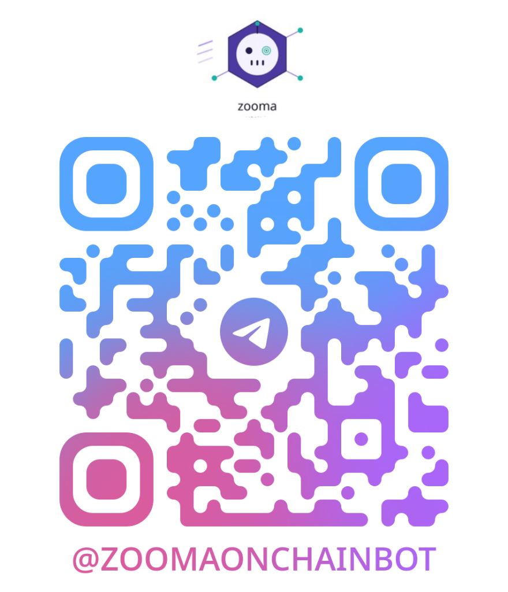

# ZOOMA Onchain Intelligence

> **Our First Web3 Project**: An autonomous, intelligent Solana trading and scanning bot that monitors the blockchain 24/7, detects scams, protects capital, and executes trades automatically.

  
   
  <b>Scan the QR code to join or message us directly on Telegram:</b>
   
  <a href="https://t.me/ZOOMAONCHAINBOT"><b>@ZOOMAONCHAINBOT</b></a>

---

## Welcome to ZOOMA

ZOOMA is our very first web3 project. We built it to solve a major problem that everyday crypto traders face: **the speed and risks of the Solana blockchain**.

On Solana, hundreds of new tokens launch every single minute. Some multiply in value by 10x, 50x, or 100x. However, the majority are scams, rug pulls, or sudden dumps where the creators or large investors sell all their tokens at once, leaving regular holders with nothing.

To stay safe and make money, a trader traditionally had to sit in front of computer screens all day and night, manually reading code, checking creator wallets, and trying to react in split seconds.

**ZOOMA does all of this for you automatically.** It connects directly to live blockchain streams, uses artificial intelligence to inspect every token, blocks dangerous launches, executes simulated trades automatically, and immediately protects your funds the moment danger is detected.

Best of all, you can control and monitor everything right from your phone through Telegram.

---

## Core Capabilities (Explained for Beginners)

Here is what ZOOMA can do in plain, simple terms:

### 1. Autonomous Single-Trade Automation (Auto-Buy and Auto-Sell)
You do not need to constantly watch charts or press buy and sell buttons.
* **Automated Entry (Buy)**: When ZOOMA finds a verified token with strong potential, it buys automatically.
* **Real-Time Tracking**: It monitors the price, volume, and holders around the clock.
* **Automated Exit (Sell)**: When the token reaches its profit target (for example +50%) or starts to pull back, the bot sells automatically to lock in your money.
* **Full Hands-Free Lifecycle**: From entry to exit, the entire trade is completed automatically in a single trade cycle.

### 2. Real-Time Dump Shield and Anti-Rug Protection
In crypto, a "dump" happens when a dishonest token creator or a "whale" (someone holding a huge amount of coins) sells off all their coins, crashing the price.
* ZOOMA watches creator wallets and big trades in fractions of a second.
* If a creator sells their tokens or massive sell pressure hits the market, the Dump Shield triggers an **emergency auto-sell** in milliseconds.
* Your position is closed immediately, pulling your money out before the token collapses.

### 3. Strict 5% Maximum Loss Limit
Capital preservation is our highest priority.
* ZOOMA is strictly programmed so that **no trade is ever allowed to lose more than 5.0%**.
* If a token begins dropping and hits the loss limit, the bot exits immediately to protect your remaining 95%+ capital.
* You never have to worry about a trade going to zero.

### 4. Flexible JEV Artificial Intelligence Analysis
Instead of using fixed, rigid rules on every coin, ZOOMA uses JEV (our predictive artificial intelligence engine).
* **Flexible Sizing**: For safer, well-backed tokens, JEV increases your position size (for example, $3.00 to $3.75). For brand-new micro-caps with higher volatility, JEV reduces the size (for example, $1.25 to $1.75) to keep you safe.
* **Flexible Stop-Loss**: JEV sets custom stop-loss limits (from 1.8% up to 4.5%, never exceeding 5.0%) based on how volatile the specific token is.
* **Flexible Profit Targets**: High-velocity runners get bigger targets (up to +100% or +120%), while quick scalps lock in profits at +25% to +35%.

### 5. Superfast Sub-Second Pump.fun Drop Sniper
Pump.fun is one of the most active token launchpads in the world.
* ZOOMA connects directly to live WebSocket feeds and detects new token launches in less than 300 milliseconds.
* It automatically checks that the creator holds less than 5% of the supply, that authorities are renounced, and that no malicious code exists.
* Trades are fired instantly with zero waiting time.

### 6. Multi-Channel Market Research
ZOOMA does not just monitor one platform. It continuously scans across all major Solana trading channels:
* **Meteora DLMM**: Next-generation dynamic liquidity market makers.
* **Raydium (CPMM and CLMM)**: The primary decentralized exchange on Solana.
* **Moonshot**: Clean launchpad tokens with locked liquidity.
* **Pump.fun**: Early micro-cap fair launches and graduations.

### 7. AI Pattern Learning and Profit Maximizer
ZOOMA learns like an experienced human trader:
* It keeps a live memory of which market patterns win and which ones lose.
* When it spots a pattern with an 80%+ historical win rate, it automatically optimizes trade sizing and widens profit targets to maximize your earnings.

### 8. Smart Money and Top Trader Radar
The top 1% of crypto traders consistently find 100x to 1000x winners before anyone else.
* ZOOMA scans historical breakout tokens and tracks the original early buyers and top snipers.
* Whenever one of these elite wallets buys a new token, ZOOMA detects the on-chain transaction and sends you an immediate alert.

### 9. Risk-Free Virtual Practice Wallet (Paper Trading)
You do not need to risk real money to see ZOOMA in action.
* You can fund a built-in virtual paper wallet with just **$10 USD**.
* The bot executes simulated trades using real live market prices and live liquidity pools.
* You can watch your wallet balance, track win rates, and verify performance completely risk-free.

### 10. Self-Cleaning Telegram Interface (Vapor Messages)
Crypto chats can get messy quickly.
* Whenever you send a slash command (like `/trending` or `/status`), ZOOMA delivers a detailed response with images and live buttons.
* After **45 seconds**, the messages cleanly dissolve like vapor, leaving your Telegram chat spotless and clutter-free.

---

## Telegram Bot Commands

You can control ZOOMA by sending simple commands to [@ZOOMAONCHAINBOT](https://t.me/ZOOMAONCHAINBOT):

| Command | What It Does |
| :--- | :--- |
| `/autotrade <token CA>` | Launches an autonomous single trade (Auto-Buy, Dump Shield, and Auto-Sell). |
| `/dumps` | Opens the Real-Time Dump Shield dashboard to see active protections and intercepted dumps. |
| `/sniper [on\|off]` | Turn the millisecond drop sniper engine on or off anytime. |
| `/pump` | View verified ultra-safe Pump.fun token drops and Raydium graduations. |
| `/insider` | Scan for brand-new verified Solana launches that are 10 to 30 minutes old. |
| `/gems` | View verified solid gems and early 100x breakout candidates. |
| `/trending` | View the top 15 trending tokens on Solana with live price changes and volume. |
| `/fund <amount>` | Fund your virtual practice wallet (minimum $10 USD, for example `/fund 10`). |
| `/papertrade` | Open the trading control center to toggle auto-trading and view settings. |
| `/stoppapertrade` | Pause trading and view a full summary of total profit made on your funded capital. |
| `/positions` | Inspect your currently open trades with real-time profit and loss calculations. |
| `/balance` | Check your practice wallet available cash, total earnings, and win rate. |
| `/close <token CA>` | Manually close an open position at live market rates (or `/close all`). |
| `/history` | View a history of your closed trades, winners, and total return. |
| `/traders` | View the leaderboard of 100x to 1000x top trader wallets tracked by the bot. |
| `/channels` | Run a multi-channel scan across Meteora, Raydium, and Moonshot. |
| `/patterns` | Inspect the AI pattern learning dashboard and see which setups are most profitable. |
| `/scan <token CA>` | Run a comprehensive security audit on any contract address and get 1-tap trading links. |
| `/wallets` | View the list of smart money wallets currently being tracked in real time. |
| `/help` | Display the primary command directory and quick links. |

---

## How to Get Started in 3 Easy Steps

1. **Open Telegram**: Scan the QR code above or search for **`@ZOOMAONCHAINBOT`** in your Telegram app.
2. **Fund Your Practice Wallet**: Send `/fund 10` to deposit $10 into your virtual paper trading wallet.
3. **Turn On Auto-Trading**: Send `/papertrade on` to let the bot automatically take trades on verified alerts, or send `/autotrade <token CA>` to test any specific Solana coin!

---

## Technical Architecture

For developers and technical users, ZOOMA is powered by a modern, high-performance web3 stack:
* **Solana RPC and Helius Enhanced Webhooks**: Sub-second on-chain transaction ingestion.
* **Pumpportal WebSocket Feed**: Millisecond WebSocket connection for real-time creation and trade events.
* **JEV TypeSafe System One AI**: Deterministic probabilistic reasoning for rug score calculations, risk tiering, and dynamic trade sizing.
* **DexScreener and Jupiter APIs**: Real-time liquidity pool resolution and live pricing.
* **TypeScript and Node.js**: Clean, type-safe execution engine running on an always-on server.
* **Dual-Layer Persistence**: Local resilient JSON ledger combined with Supabase cloud database synchronization.

---

  <b>ZOOMA Onchain Intelligence: First Web3 Project</b> 
  Automated Solana Breakout Engine, Dump Shield, and AI Paper Trader.

